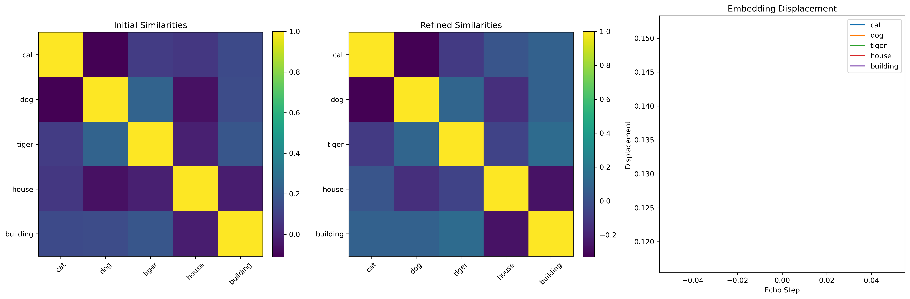
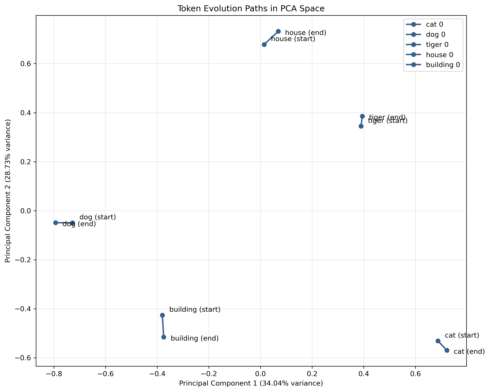
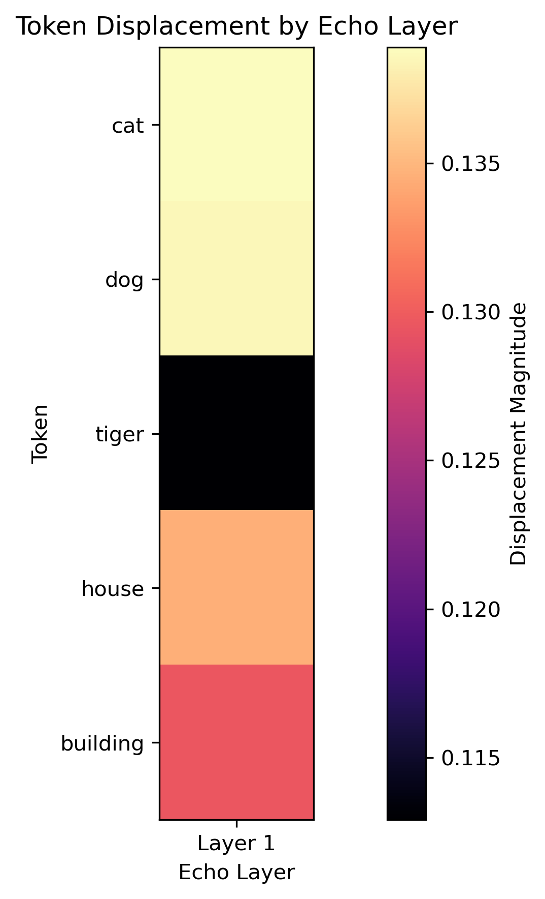

# Seeded Sphere Search

Neural embedding transformation with echo refinement for semantic search.

## Overview

Seeded Sphere Search is a novel approach to semantic search that uses echo refinement mechanisms to transform word embeddings based on their semantic relationships. This project implements the core Echo Mechanism that enhances embeddings by iteratively moving them in the embedding space according to their relationship strengths.

## Key Features

- **Echo Refinement Mechanism**: Iteratively refines word embeddings based on semantic relationships
- **Vectorized Operations**: Optimized matrix operations replace O(N²) nested loops for better performance with large vocabularies
- **Parameter Auto-tuning**: Automatically find optimal parameters for different datasets
- **Evolution Tracking**: Detailed tracking of embedding movements through refinement layers
- **Sparse Relationship Support**: Support for large vocabularies using KNN-based sparse relationship matrices
- **Visualization Tools**: Comprehensive visualization of embedding transformations

## Usage Example

```python
from echo_mechanism import EchoLayer

# Initialize echo layer
echo_layer = EchoLayer(
    delta=0.1625,  # Step size for refinement
    freq_scale=0.325,  # Frequency scaling factor
    min_layers=1,
    max_layers=5
)

# Apply to embeddings
refined_embeddings, evolution = echo_layer(
    embeddings,                # Input embeddings [batch_size, num_tokens, embedding_dim]
    frequencies,               # Token frequencies [batch_size, num_tokens]
    relationship_matrix,       # Relationship strengths [batch_size, num_tokens, num_tokens]
    track_mode="detailed"      # Evolution tracking detail level
)
```

## Advanced Features

### Sparse Relationships for Large Vocabularies

```python
from echo_mechanism import SparseEchoLayer

# Initialize sparse echo layer
sparse_layer = SparseEchoLayer(
    delta=0.15,
    freq_scale=0.3,
    min_layers=1,
    max_layers=4
)

# Apply to embeddings (automatically computes KNN relationships)
refined_embeddings, evolution = sparse_layer(
    embeddings,
    frequencies,
    k_neighbors=10,            # Number of neighbors to consider
    track_mode="tokenlevel"    # Track per-token evolution
)
```

### Parameter Tuning

```python
# Auto-tune parameters
best_delta, best_freq_scale = echo_layer.tune_parameters(
    embeddings,
    frequencies,
    relationship_matrix
)

print(f"Optimal parameters: delta={best_delta}, freq_scale={best_freq_scale}")
```

### Parameter Sweep

```python
from echo_mechanism import parameter_sweep

# Run parameter sweep
sweep_results = parameter_sweep(
    embeddings,
    frequencies,
    relationship_matrix,
    delta_range=[0.05, 0.1, 0.15, 0.2, 0.25],
    freq_scale_range=[0.1, 0.2, 0.3, 0.4, 0.5]
)

print(f"Best parameters: {sweep_results['best_params']}")
```

## Visualization Examples

### Overview


### Token Evolution Paths


### Displacement Heatmap


## Installation

```bash
git clone https://github.com/Dennis-J-Carroll/Seeded-Sphere-Search.git
cd Seeded-Sphere-Search
pip install -r requirements.txt
```

## Implementation Notes

The Echo Mechanism implementation addresses several key challenges:

1. **Quadratic Complexity**: Vectorized operations replace nested loops to optimize the O(N²) relationship computation
2. **Parameter Sensitivity**: Auto-tuning capabilities help find optimal parameters for different datasets
3. **Batch Evolution Tracking**: Enhanced tracking with support for per-token evolution details

## License

MIT License
